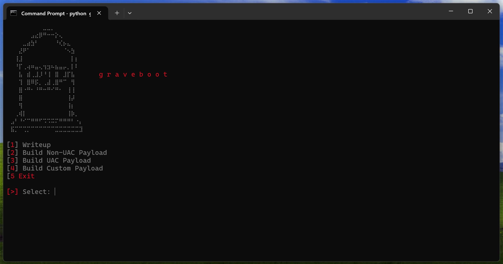

# GraveBoot - WinReset Survival Framework

[](https://github.com/rdprs/GraveBoot)
[](LICENSE)


GraveBoot is a specialized post-exploitation framework designed to subvert the **Windows "Reset this PC" (WinRE)** mechanism. By leveraging Image File Execution Options (IFEO) and various UI automation tools, GraveBoot intercepts system restoration attempts, aborts the legitimate recovery process, and simulates a successful factory reset while maintaining persistent control over the host environment.

---

## TECHNICAL ARCHITECTURE

The core of GraveBoot lies in the manipulation of how Windows handles privileged system flows. When a user initiates a system reset, Windows invokes several administrative binaries. GraveBoot hooks these calls to pivot from a system-sanctioned "wipe" to an attacker-controlled simulation.

### 1. IFEO Registry Hijacking (Mode 3)

The primary persistence vector utilizes the **Image File Execution Options** developer feature. By modifying the local machine registry, GraveBoot installs itself as a "debugger" for critical system binaries.

**Target Path:**
```
HKLM\SOFTWARE\Microsoft\Windows NT\CurrentVersion\Image File Execution Options\SystemSettingsAdminFlows.exe
```

**Mechanism:**
When `SystemSettingsAdminFlows.exe` is called, the kernel checks for a `Debugger` value. GraveBoot sets this value to point to a malicious proxy script (`Proxy.vbs`).
- **Argument Filtering:** The proxy script monitors for the `FeaturedResetPC` argument.
- **Interception:** If detected, the legitimate administrative flow is terminated, and the GraveBoot payload is executed in its place.

### 2. UI Automation & Event Hooks (Mode 2)

In environments where direct registry manipulation is restricted or monitored, GraveBoot utilizes background monitoring via:
- **WinEvent Hooks:** Capturing window creation events for the Reset UI.
- **WMI Event Subscriptions:** Monitoring for process creation related to recovery.
- **Logic:** Upon detection of the "Reset this PC" window handle, the tool executes a `WinKill` command and immediately overlays a pixel-perfect fake reset interface.

---

## OPERATIONAL MODES

| Mode | Identification | Implementation Strategy |
| :--- | :--- | :--- |
| **Mode 2** | UI Interceptor | Utilizes AHK or WMI to monitor and terminate recovery windows in real-time. Requires lower initial privileges than IFEO. |
| **Mode 3** | IFEO Proxy | High-reliability mode using `SystemSettingsAdminFlows.exe` hijacking. Often paired with UAC bypasses (e.g., RedSun) for deployment. |
| **Mode 4** | Custom Logic | Extensible mode allowing operators to define bespoke actions—such as selective file deletion—following the termination of the recovery UI. |

---

## RECOVERY SIMULATION & SURVIVAL

GraveBoot does not merely block the reset; it simulates the experience to deceive the end-user. After the legitimate reset process is killed, the tool can:
1. **Mimic Progress:** Display a 1:1 replica of the "Resetting this PC" percentage screen.
2. **Selective Sanitization:** Delete user documents and non-essential applications to give the illusion of a fresh install.
3. **Payload Preservation:** Ensure the primary implant remains in a hidden directory or re-injects itself into the "clean" OS state upon the next boot.

---

## DEFENSIVE COUNTERMEASURES

Detection of GraveBoot requires monitoring for anomalies in system-level execution options and administrative process behavior.

- **Registry Auditing:** Continuous monitoring of the `IFEO` registry hive for any `Debugger` entries.
- **Process Lineage:** Alerting on instances where `SystemSettingsAdminFlows.exe` spawns unexpected children such as `wscript.exe`, `cscript.exe`, or `cmd.exe`.
- **Out-of-Band Recovery:** Systems suspected of infection should never be reset via the internal "Reset this PC" feature. A full format and reinstall from a verified external USB source is required to bypass GraveBoot's interception logic.

---

## DISCLAIMER
This software is intended for research, educational, and authorized red-teaming purposes only. The misuse of this information for unauthorized access or disruption of computer systems is strictly prohibited.
